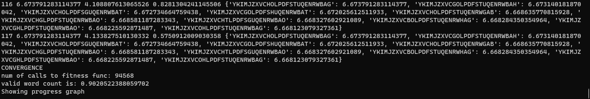
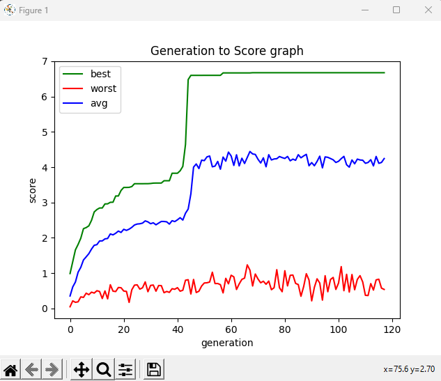

# Genetic Algo Substitution Cipher #
A basic tool which automatically decrypts substitution cipher using 3 methods regular|darwin|lamarck.

## Usage ##

### Python ###
```commandline
Help message 
> python main.py -h

Executing single Lamarck Algorithm
> python main.py lamarck

Execting multiple Darwin Algorithm
> python main.py darwin -t 10
```






### Windows Exe ###
```commandline
Help message 
> solver.exe -h

Executing single Regular Algorithm
> solver.exe regular

Execting multiple Lamarck Algorithm
> python main.py lamarck -t 10
```


## Remarks ##
* Additional files should be located next tot the main.py file (dict.ttx, enc.txt etc.)
* the results will be in plain.ttx & perm.txt output files in the current directory.
* You may see the default parameters we chose to our algorithm in the head of main.py file
* The algorithm is a best-effort, which means plain.txt might contains incorrect words.
